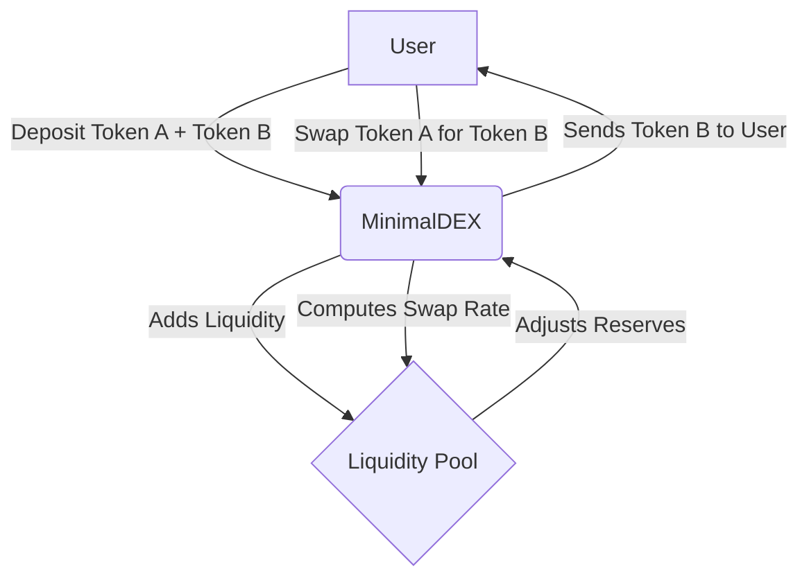

# MinimalDex

References
* https://github.com/Uniswap/v2-periphery/blob/master/contracts/UniswapV2Router02.sol#L61
* https://github.com/Uniswap/v2-periphery/blob/master/contracts/UniswapV2Router02.sol#L212

## Requirements
* Add Liquidity – The system must allow users to provide liquidity.
* Token Swaps – The system must enable token swaps.
* Deployed on Sepolia testnet

## Assumptions
* Only ERC20 tokens are supported
* There is no slippage protection
* No remove liquidity
* No deadline enforcement
* No charge of fees for swaps

## Theory
### The core forumal: x * y = k
At the heart of AMMs like Uniswap V2 is the constant product formula:

```
x * y = k
```

Where:
* x = Reserve of Token A in the liquidity pool
* y = Reserve of Token B in the liquidity pool
* k = A constant that remains unchanged unless liquidity is added or removed

When a user swaps Token A → Token B, the pool’s reserves adjust so that the product remains constant.

### Example
Let's say we have a liquidity pool with 100 USDC and 100 USDT. The constant product is 100 * 100 = 10000.

Now, if someone wants to swap 10 USDC for USDT, the new reserve of USDC will be 90 and the new reserve of USDT will be 110.


## Architecture



## Installation
```bash
yarn install
```

## Environment Variables
```bash
cp .env.example .env
```

Edit the `.env` file with your own values.

## Compile
```bash
npx hardhat compile
```

## Test
```bash
npx hardhat test
```

## Coverage
```bash
npx hardhat coverage
```

-----------------|----------|----------|----------|----------|----------------|
File             |  % Stmts | % Branch |  % Funcs |  % Lines |Uncovered Lines |
-----------------|----------|----------|----------|----------|----------------|
 contracts/      |      100 |       90 |      100 |      100 |                |
  MinimalDex.sol |      100 |    88.89 |      100 |      100 |                |
  MockERC20.sol  |      100 |      100 |      100 |      100 |                |
-----------------|----------|----------|----------|----------|----------------|
All files        |      100 |       90 |      100 |      100 |                |
-----------------|----------|----------|----------|----------|----------------|

## Deploy locally
```bash
npx hardhat node

# Make sure PRIVATE_KEY is set in the `.env` file

npx hardhat run scripts/deployTokens.ts --network localhost
npx hardhat run scripts/deployDex.ts --network localhost
```
1. Make sure you have the correct private key in the `.env` file
2. Run the `deployTokens.ts` script to deploy the tokens
3. Run the `deployDex.ts` script to deploy the dex

## Deploy on Sepolia
```bash
npx hardhat run scripts/deployTokens.ts --network sepolia
npx hardhat run scripts/deployDex.ts --network sepolia
```

deployed contracts on *Sepolia*:
```json
{
  "tokenA": "0x26F8fa526dcbD53Ec039302FF319b517ecc8F32f",
  "tokenB": "0x8988061B19e06bd40cF84a04fCdCA53614477Ba5",
  "deployer": "0x24BaE140446f32cDb02Cf09B18fBA34Ba4527B57",
  "dex": "0xa1c6e4C088A9847e3AD2E832687a9B1B0452ac6B"
}
```

## Verify
```bash
npx hardhat run scripts/verifyContracts.ts --network sepolia
```

## Interact with the contract
```bash
npx hardhat run scripts/testInteraction.ts --network sepolia
```

